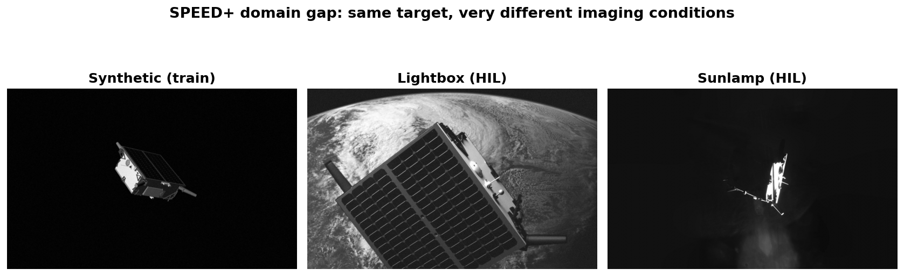
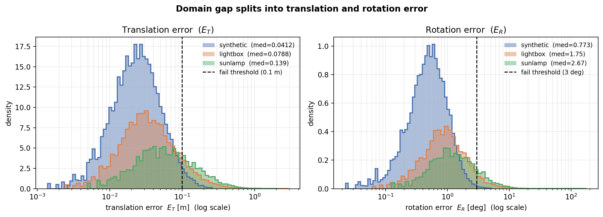
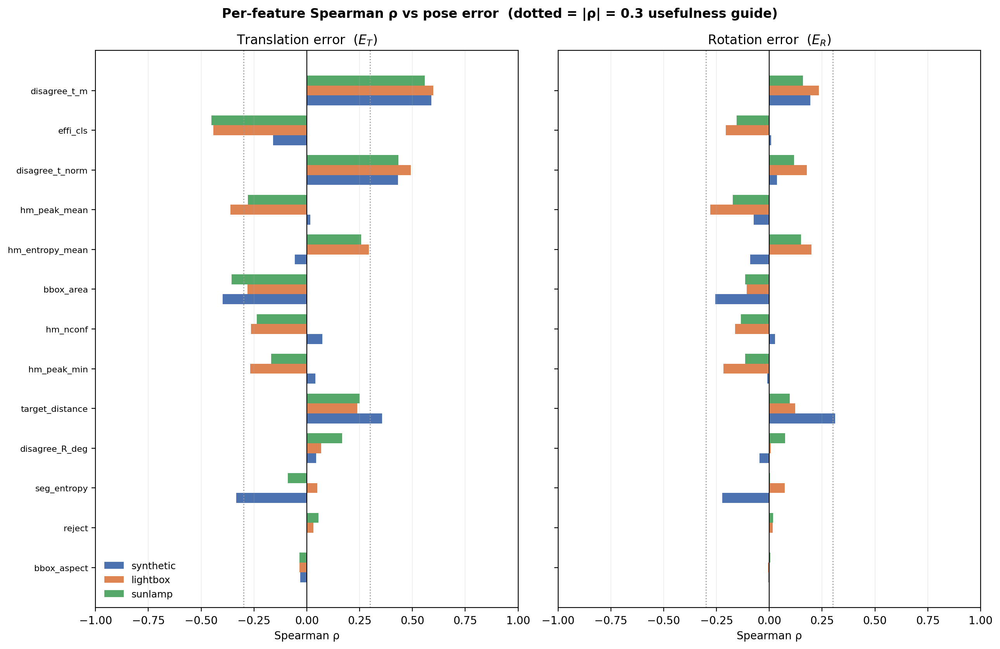
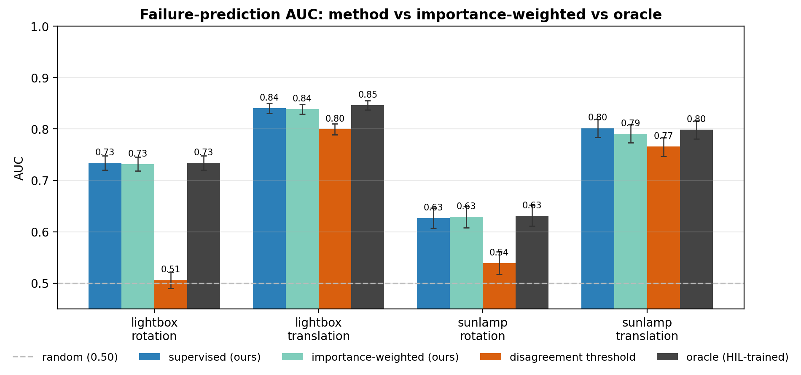
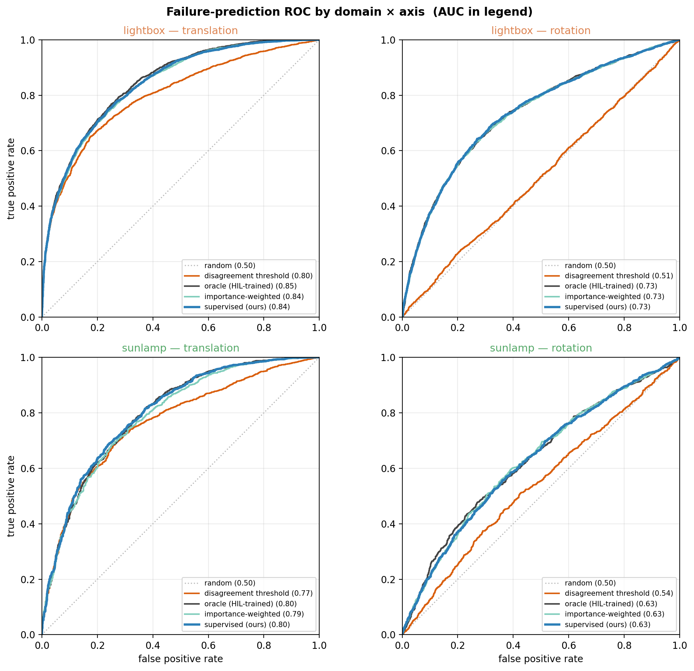
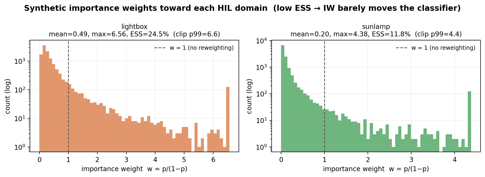
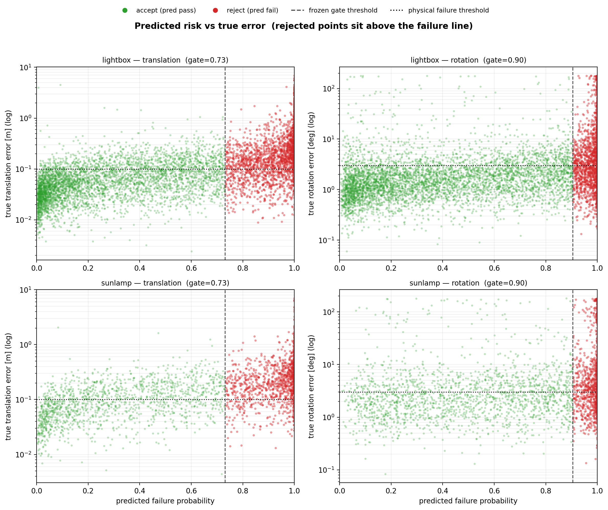

# Test-Time Confidence Prediction for Spacecraft Pose Estimation Under Domain Shift

[Anjali Sreenivas (anjalisr)](https://github.com/anjalis17), [Lundeen Cahilly (lcahilly)](https://github.com/lundeen06)

## Introduction

This project builds a test-time confidence predictor for [SPNv2](https://github.com/tpark94/spnv2), a state-of-the-art spacecraft pose estimator. SPNv2 already works hard to close the synthetic-to-real domain gap through multi-task learning and Online Domain Refinement (ODR), but its error is still substantially higher on the real hardware-in-the-loop (HIL) domains than on the synthetic data it was trained on, and that degradation is not uniform across images. SPNv2 itself flags uncertainty quantification as an open problem, which finds use in downstream navigation filters (e.g., UKF).

Our work aims to address that gap. Given a new image at deployment, we predict whether SPNv2's pose estimate has failed using features read off a single forward pass and without labels from the deployment domain. Our calibrated answer allows a downstream navigation filter (e.g. a UKF) to down-weight or reject unreliable pose measurements before they corrupt the state estimate.

## Abstract

We frame SPNv2 "success" as a binary failure prediction against an absolute, domain-independent physical error threshold (translation `E_T > 0.10m`, rotation `E_R > 3.0°`), treating translation and rotation as separate measurements and thus failure axes. From a single forward pass of the SPNv2 model we extract 13 internal model features (cross-head pose disagreement, segmentation and heatmap entropy, peak heights, detection confidence), train a class-weighted logistic regression on synthetic labels only, and evaluate on the lightbox and sunlamp HIL domains. The predictor matches an oracle trained on HIL labels (translation AUC 0.84 / 0.80 vs 0.85 / 0.80) with zero target labels, which shows the feature-to-failure mapping transfers across the gap even when the head disagreement signal does not. We also test importance weighting in attempt to improve cross-domain error prediction due to covariate shift: the results are unchanged here, confirming that the domain shift is in `p(x)` and not `p(y|x)`, so this feature potentially stands as insurance for more severe domain shifts.

## The domain gap

SPNv2 is trained on synthetic imagery but deployed on real images with harsh illumination, specular glare, and deep shadows. The same "Tango" target spacecraft can look very different across imaging domains



Across the gap, mean translation error climbs `0.05 -> 0.18 -> 0.22 m` and the failure rate `11% -> 41% -> 63%` from synthetic to lightbox to sunlamp. Rotation is even worse, with a `p99` near `150-167°`, corresponding to the `180°` symmetry flips (visually ambiguous) of the satellite body.



## The feature space

Rather than use pure image pixel statistics, which are not consistent across the domain gap, we decided to read 13 features directly off of SPNv2's forward pass. These features live in pose and confidence space, and thus are tied directly to the prediction rather than the image's appearance, and all of them are available at deployment with no extra labels. Several build on the fact that SPNv2's internal architecture produces two independent pose estimates per image (heatmap-PnP head and EfficientPose regression head) before combining them into one final estimate, so the two heads can be compared against each other as a rough confidence check.

The `ρ` columns are the Spearman correlation between each feature and the true error, averaged over the two HIL domains.

| Feature | What it is | ρ vs E_T | ρ vs E_R |
|---|---|:---:|:---:|
| `disagree_t_m` | Distance between the two heads' predicted translations, in meters | **0.58** | 0.20 |
| `disagree_t_norm` | Same disagreement, normalized by mean target distance | 0.46 | 0.15 |
| `disagree_R_deg` | Geodesic angle between the two heads' predicted rotations | 0.12 | 0.04 |
| `effi_cls` | Max EfficientPose detection confidence | -0.45 | -0.18 |
| `hm_peak_mean` | Mean keypoint-heatmap peak height (localization confidence) | -0.32 | -0.23 |
| `hm_peak_min` | Peak height of the worst-localized keypoint | -0.22 | -0.17 |
| `hm_nconf` | Number of keypoints above the detection threshold | -0.25 | -0.15 |
| `hm_entropy_mean` | Mean per-keypoint heatmap entropy (spread) | 0.28 | 0.18 |
| `seg_entropy` | Mean entropy of the foreground segmentation mask | -0.02 | 0.04 |
| `target_distance` | Predicted range to target, `‖t‖` | 0.25 | 0.11 |
| `bbox_area` | Area of the predicted bounding box | -0.32 | -0.11 |
| `bbox_aspect` | Aspect ratio of the predicted bounding box | -0.03 | 0.00 |
| `reject` | Heatmap-PnP rejection flag (dropped, zero variance on synthetic) | — | — |

The takeaway is that no single feature is enough. Translation has one strong, transferable signal in `disagree_t_m` (stable at `ρ ≈ 0.56-0.60` across all three domains), but the matching rotation feature `disagree_R_deg` is essentially dead. Rotation failures are flawed, because `180°` symmetry of the Tango spacecraft flips can fool both pose heads at once. In this case, the heads still agree with each other even when both are long, leaving head-disagreement structurally blind to these failures. Rotation reliability instead has to be pieced together from several weaker confidence cues like `hm_peak_mean` and `effi_cls`.



## Results

We train a class-weighted logistic regression on synthetic features with binary fail/pass labels, then apply it unchanged to HIL. We also add importance weighting (IW) for covariate-shift correction: a domain classifier estimates the density ratio `w = p/(1-p)` and reweights synthetic samples toward those that look HIL-like. The oracle is the same model trained on HIL labels and serves as the upper bound.

The synthetic-only method matches the HIL-trained oracle. We predict failure on a new domain with no labels from it, because the feature-to-failure mapping transfers.

| Domain | Axis | Random | Disagreement | Method | IW | Oracle |
|--------|------|:------:|:------------:|:------:|:----:|:------:|
| lightbox | E_T | 0.500 | 0.800 | **0.841** | **0.839** | 0.846 |
| lightbox | E_R | 0.500 | 0.506 | **0.734** | **0.732** | 0.734 |
| sunlamp  | E_T | 0.500 | 0.766 | **0.802** | **0.790** | 0.799 |
| sunlamp  | E_R | 0.500 | 0.539 | **0.627** | **0.629** | 0.631 |



Translation is strong. Rotation is harder but not hopeless: although the disagreement baseline collapses to chance, the full feature set still recovers moderate signal (AUC 0.73 / 0.63) from the weaker heatmap and confidence cues.



Importance weighting ended up as inert. The domain shift is real and large (domain-classifier AUC 0.82 / 0.91, effective sample size collapsing to 12-24%), yet AUC does not move. This confirms the fact that correcting our `p(x)` is unnecessary because our predicted `p(y|x)` is already stable. IW, however, costs nothing and is the mechanism that could activate under a more severe, unseen on-orbit shift.



## Uncertainty gating

Freezing the decision threshold on the synthetic-validation split and applying it to HIL gives a deployable accept/reject gate. The translation gate is genuinely useful (precision 0.75 / 0.85 at recall around 0.62). The rotation gate is marginal, consistent with the weaker rotation signal.

| Domain | Axis | Precision | Recall | Flagged rate |
|--------|------|:---------:|:------:|:------------:|
| lightbox | E_T | 0.753 | 0.634 | 0.345 |
| lightbox | E_R | 0.550 | 0.471 | 0.235 |
| sunlamp  | E_T | 0.847 | 0.622 | 0.463 |
| sunlamp  | E_R | 0.591 | 0.423 | 0.324 |

Predicted failure probability correlates with true error, so the score is a calibrated risk ranking rather than an error regressor, which is what a navigation filter needs to gate or down-weight a measurement.



## Repo structure

```
src/
  features/   get_model_features.py     # 13 SPNv2-internal features from one forward pass
              loaders.py
              plot_feature_scales.py
  pipeline/   baselines.py              # random + SPNv2 head-disagreement threshold
              models.py                 # supervised + importance-weighted LR
              iw_diagnostics.py         # stress-tests whether IW actually helps
  utils/      errors.py                 # pose-error / quaternion math
              data.py                   # SPEED+ label / camera loading
  analysis/   run_all.py + plots/       # regenerate every writeup figure
results/      *.npy / *.csv             # features, per-image errors, outputs (gitignored)
figures/      *.png / *.pdf             # generated figures (gitignored)
report/       final_report.tex          # CS229 final report
```

## Usage

1. Download [SPEED+](https://techfinder.stanford.edu/technology/next-generation-spacecraft-pose-estimation-dataset-speed)
2. Install the [SPNv2](https://github.com/tpark94/spnv2) model
3. Set up the environment:
   ```bash
   uv sync
   source .venv/bin/activate
   ```
4. Run SPNv2 inference on SPEED+ (GPU recommended):
   ```bash
   bash scripts/run_test.sh
   ```
5. Run the pipeline from the repo root:
   ```bash
   python src/features/get_model_features.py   # extract features
   python src/pipeline/baselines.py            # random + disagreement baselines
   python src/pipeline/models.py               # supervised + importance-weighted LR
   python src/analysis/run_all.py              # regenerate all figures
   ```

## Analysis plots (writeup order)

| Part | Plot | Script | Figure |
|------|------|--------|--------|
| 1, domain gap | pose-error distribution | `plot_error_distributions.py` | `pose_error_distribution.*` |
| 1 | error split into translation/rotation | `plot_error_distributions.py` | `pose_error_components.*` |
| 2, features see the gap | per-feature Spearman ρ vs E_T/E_R | `plot_feature_correlation.py` | `feature_spearman.*` |
| 3, method catches failures | ROC, 4 panels | `plot_roc_curves.py` | `roc_curves.*` |
| 3 | AUC bars (method vs IW vs oracle) | `plot_auc_bars.py` | `auc_bars.*` |
| 4, usable gate | synth-val threshold frozen, HIL precision/recall | `plot_operating_point.py` | `operating_point.*` |
| 4 | predicted risk vs true error | `plot_risk_vs_error.py` | `risk_vs_error.*` |
| 5, why IW is inert | importance-weight histogram p/(1-p) | `plot_iw_weights.py` | `iw_weights.*` |

## Citation

Built on SPNv2 ([Park & D'Amico, 2023](https://doi.org/10.1016/j.asr.2023.03.036)) and the
[SPEED+](https://techfinder.stanford.edu/technology/next-generation-spacecraft-pose-estimation-dataset-speed)
dataset from Stanford's Space Rendezvous Laboratory.

```bibtex
@article{park2023spnv2,
    title  = {Robust multi-task learning and online refinement for spacecraft pose estimation across domain gap},
    author = {Park, Tae Ha and D'Amico, Simone},
    journal = {Advances in Space Research},
    year   = {2023},
    doi    = {10.1016/j.asr.2023.03.036},
}
```
